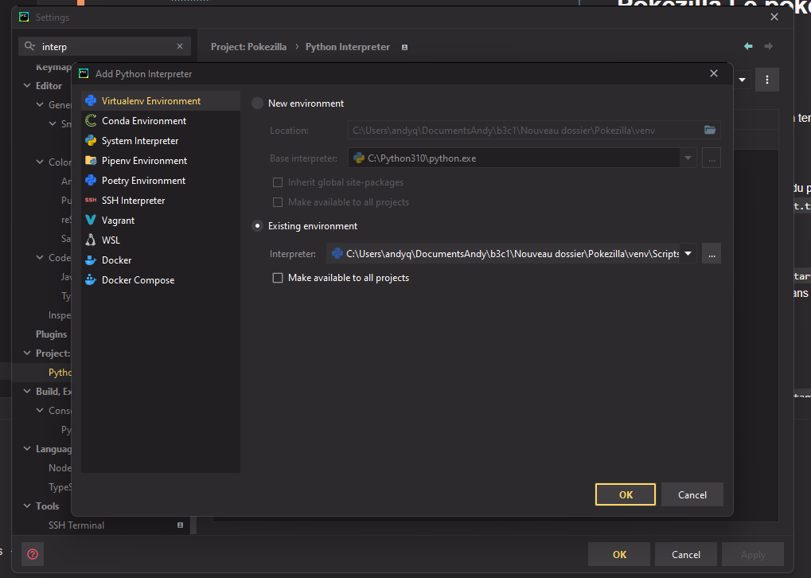

# Pokezilla Le pokedex revisité
## Installation tuto
1. Cloner le projet
2. Taper cette commande dans un terminal (à la racine du projet)  
`python -m venv ./venv`
3. Puis il faut activer le venv  
`.\venv\Scripts\activate`
4. Puis installer les requirements du projet  

`pip install -r .\requirement.txt`  
`cd .\theme\static_src\`  
`npm install`  
`cd ../..`  
`python manage.py tailwind start`  

6. Ajouter l'interpréteur du venv dans l'IDE (setting, barre de recherche :
interpreter ) 
7. Puis ajouter l'interpreteur du venv 

11. Lancer le projet ( maj + f9 par défaut ou le logo de start en haut de l'IDE)

## Démarrer le projet
1. Lancer le projet ( maj + f9 par défaut ou le logo de start en haut de l'IDE)
2. `python manage.py tailwind start`